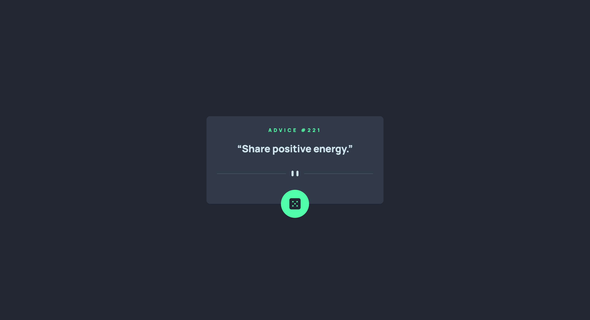

# Frontend Mentor - Advice generator app solution

This is a solution to the [Advice generator app challenge on Frontend Mentor](https://www.frontendmentor.io/challenges/advice-generator-app-QdUG-13db). Frontend Mentor challenges help you improve your coding skills by building realistic projects.

## Table of contents

- [Frontend Mentor - Advice generator app solution](#frontend-mentor---advice-generator-app-solution)
  - [Table of contents](#table-of-contents)
  - [Overview](#overview)
    - [The challenge](#the-challenge)
    - [Screenshot](#screenshot)
    - [Links](#links)
  - [My process](#my-process)
    - [Built with](#built-with)
    - [Useful resources](#useful-resources)
  - [Author](#author)
  - [Acknowledgments](#acknowledgments)

**Note: Delete this note and update the table of contents based on what sections you keep.**

## Overview

### The challenge

Users should be able to:

- View the optimal layout for the app depending on their device's screen size
- See hover states for all interactive elements on the page
- Generate a new piece of advice by clicking the dice icon

### Screenshot

### Links

- Live Site URL: [Git Pages](https://ke102882.github.io/frontend-mentor/junior/advice-generator-app-main)

## My process

### Built with

- CSS custom properties
- Semantic HTML5 markup
- Flexbox
- Mobile-first workflow
- Window API - fetch

### Useful resources

- [MDN - Fetch](https://developer.mozilla.org/en-US/docs/Web/API/fetch) - This helped me.

## Author

- Frontend Mentor - [@ke102882](https://www.frontendmentor.io/profile/ke102882)

## Acknowledgments

Thanks to all communities.

- [Frontend Mentor](https://www.frontendmentor.io/challenges)
- [Stackoverflow](https://stackoverflow.com/)
- [MDN](https://developer.mozilla.org)