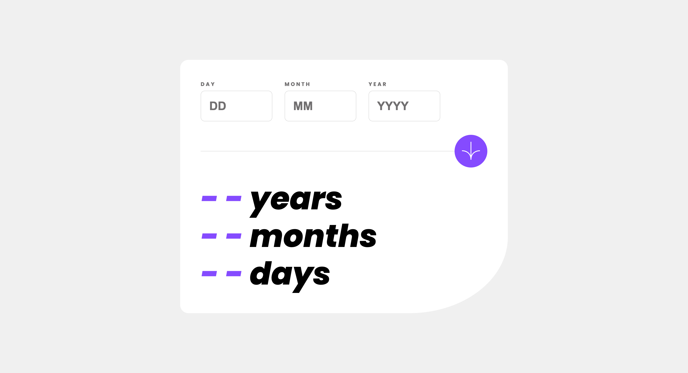

# Frontend Mentor - Age calculator app solution

This is a solution to the [Age calculator app challenge on Frontend Mentor](https://www.frontendmentor.io/challenges/age-calculator-app-dF9DFFpj-Q). Frontend Mentor challenges help you improve your coding skills by building realistic projects. 

## Table of contents

- [Frontend Mentor - Age calculator app solution](#frontend-mentor---age-calculator-app-solution)
  - [Table of contents](#table-of-contents)
  - [Overview](#overview)
    - [The challenge](#the-challenge)
    - [Screenshot](#screenshot)
    - [Links](#links)
  - [My process](#my-process)
    - [Built with](#built-with)
    - [What I learned](#what-i-learned)
    - [Useful resources](#useful-resources)
  - [Author](#author)
  - [Acknowledgments](#acknowledgments)

**Note: Delete this note and update the table of **contents** based on what sections you keep.**

## Overview

### The challenge

Users should be able to:

- View an age in years, months, and days after submitting a valid date through the form
- Receive validation errors if:
  - Any field is empty when the form is submitted
  - The day number is not between 1-31
  - The month number is not between 1-12
  - The year is in the future
  - The date is invalid e.g. 31/04/1991 (there are 30 days in April)
- View the optimal layout for the interface depending on their device's screen size
- See hover and focus states for all interactive elements on the page
- **Bonus**: See the age numbers animate to their final number when the form is submitted

### Screenshot



### Links

- Live Site URL: [Git Pages](https://ke102882.github.io/frontend-mentor/junior/age-calculator-app-main)

## My process

### Built with

- CSS custom properties
- Semantic HTML5 markup
- Flexbox
- Mobile-first workflow
- JS workflow
  - How to update the error message for a specific form field?
  - Should be use subtract seconds or use the new Date() API ?
    - if use subtract seconds...
    - if use the new Date() API...

### What I learned


Get day total of month:
```js
// month is 0~11
new Date(2023, 0, 1).getDate(); // 2023-01-01;
new Date(2023, 1, 1).getDate(); // 2023-02-01;

new Date(2023, 1, 0).getDate(); // 2023-01-31;
new Date(2023, 2, 0).getDate(); // 2023-02-28;
new Date(2023, 3, 0).getDate(); // 2023-03-31;
```


### Useful resources

- [stackoverflow - javascript age calculation](https://stackoverflow.com/questions/4076321/javascript-age-calculation) - Provide direction for thinking.
- [this is age calculator](https://www.calculator.net/age-calculator.html) - Explain the different calculation methods


## Author

- Frontend Mentor - [@ke102882](https://www.frontendmentor.io/profile/ke102882)


## Acknowledgments

Thanks to all communities.

- [Frontend Mentor](https://www.frontendmentor.io/challenges)
- [Stackoverflow](https://stackoverflow.com/)
- [MDN](https://developer.mozilla.org)